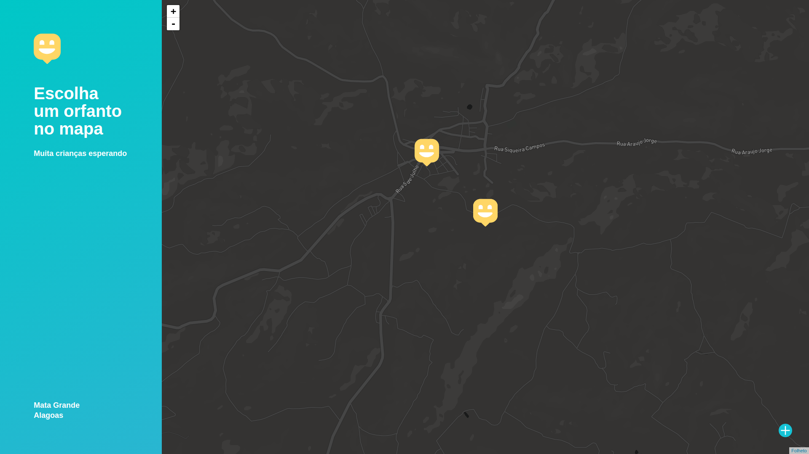
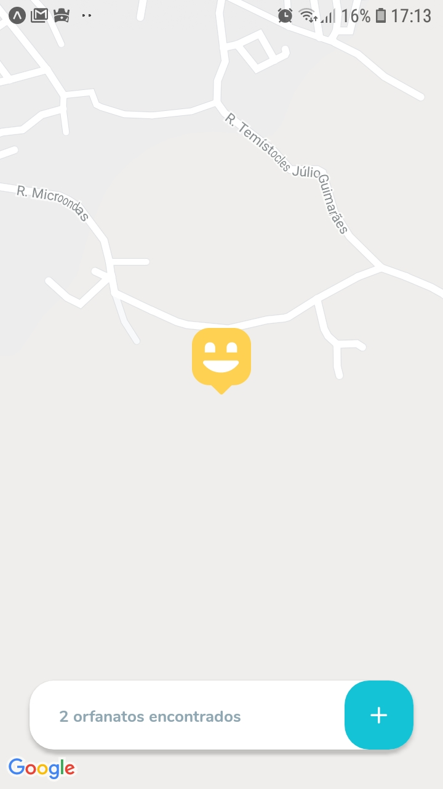

<h1 align="center">
 
    
 

</h1>

  

## Overview

This is a project created during the week of the next level 3.0 #NLW of Rocketseat, it consists of it consists of establishing a platform where you can register orphanages and find it using maps.

## Web

## Mobile

## Feature

- ⚛️ **React Js** — A JavaScript library for building user interfaces
- ⚛️ **React Native** — A lib that provides a way to create native apps for Android and iOS
- 💹 **Node Js** — A web framework for Node Js

## Getting started

### Debian and derivatives
<ol>
    <li>
        Unzip the download
    </li>
    <li>
        Run the command cd Server
    </li>
    <li>
        Run the command yarn dev or npm run dev 
    </li>
    <li>
        Run the command  cd ..  for come back 
    </li>
    <li>
        Open the folder web with cd Frontend
    </li>
    <li>
        Run the command yarn start or npm run start
    </li>
    <li>
        Open the folder mobile with cd mobile 
    </li>
    <li>
        Run expo start
    </li>
</ol>

## License

This project is licensed under the MIT License - see the [LICENSE](https://opensource.org/licenses/MIT) page for details.